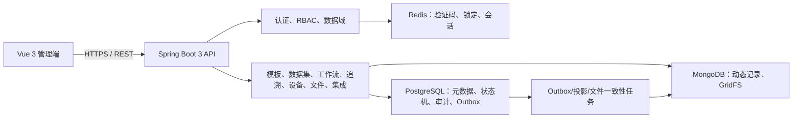
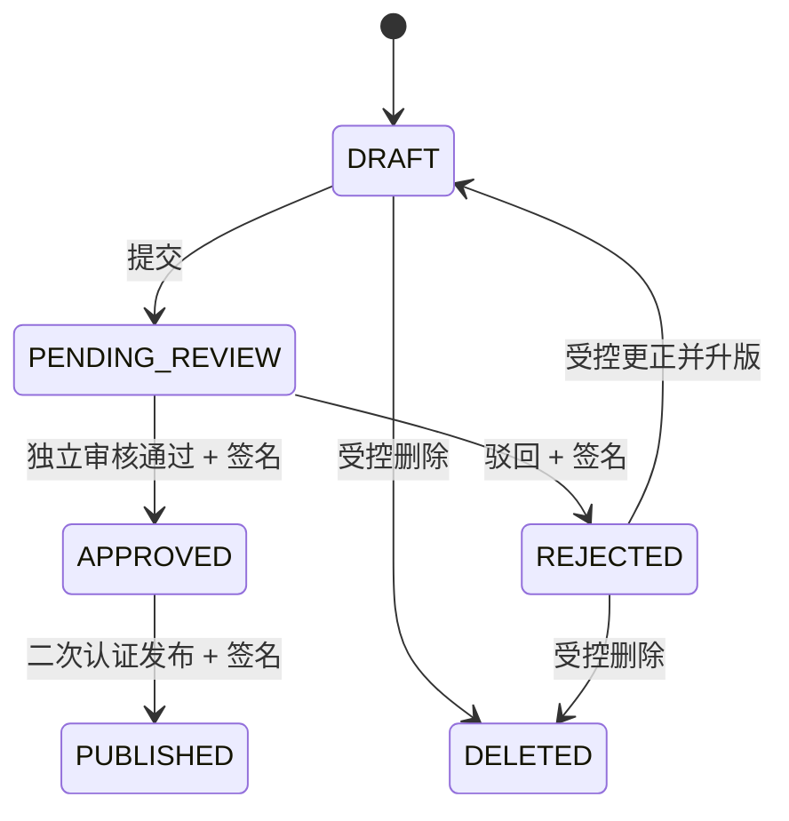

# 系统设计说明

## 总体架构

## 存储职责

- PostgreSQL 是权限、业务元数据、记录工作流、电子签名、审计链和跨库/集成事件的权威来源。Flyway V1–V33 管理结构升级。
- MongoDB 每个数据集使用独立集合，保存动态字段记录；`workflowStatus` 是读取加速投影，普通读者返回或导出非本人记录前仍以 PostgreSQL `PUBLISHED` 状态复核。
- GridFS 保存附件字节，PostgreSQL 保存业务绑定、数据域、SHA-256、上传人和删除状态。
- Redis 中安全状态均设置有效期；刷新令牌使用原子 `GETDEL`，并发刷新最多一次成功。

## 关键一致性策略

1. 数据集记录创建/更正/删除要求 `X-Idempotency-Key`，PostgreSQL Outbox 保存请求指纹和原操作人。
2. MongoDB 成功而 PostgreSQL 完成步骤失败时，事件进入可恢复状态；定时任务重试或转人工处置，不能静默丢失。
3. 工作流先提交 PostgreSQL，提交后再更新 MongoDB 投影；定时任务以 PostgreSQL 为源修复投影。
4. 文件上传若元数据事务失败会清除新建 GridFS 内容；文件删除先使元数据不可见，再尽力删除内容；孤儿/缺失内容按游标分批对账。

## 安全边界

- 服务端同时执行权限码和数据域判断；前端隐藏按钮不构成授权依据。
- access token 仅驻留内存，refresh token 为 HttpOnly、SameSite=Strict Cookie；账户冻结、改密、角色/数据域变化会在请求时重新校验。
- 设备与外部系统密钥使用 AES-GCM 加密；日志和查询响应不返回明文。
- 审计表和电子签名表由数据库触发器禁止更新/删除；审计使用带密钥版本的 HMAC 链。
- HTML/SVG 等主动内容只下载；前端不以内联 Blob 方式预览 PDF，仅允许纯文本和惰性图片类型。
- 外部写入按配置使用绑定系统、方法、路径、时间和幂等键的 `RDP-HMAC-V1`，或使用独立平台自省客户端校验外部调用方 OAuth2 token；两种模式都必须通过精确来源 IP 白名单。OAuth 自省和 HTTP 交付只连接显式主机白名单，生产同时依赖受信 DNS 与出口防火墙。

## 数据记录状态机

创建者不能审核自己的记录；驳回记录不更正不能重提；通过或发布后不允许原地更正/删除。普通读者仅能读取已发布记录或自己创建的未发布记录。
