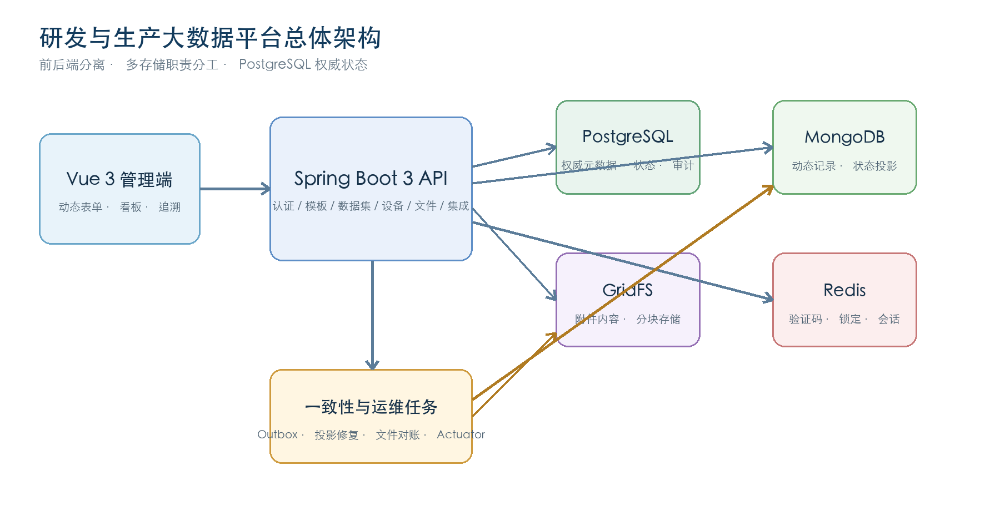
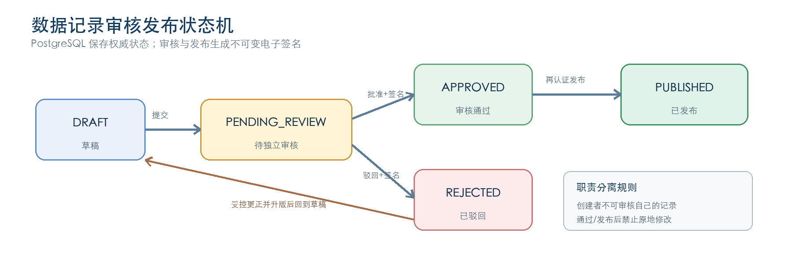

# 编制说明

本文档依据《研发与生产大数据平台数据库建设软件开发需求文档-0408》《研发与生产大数据平台项目实施方案修改2》、项目需求基线、需求追踪矩阵以及截至 2026-08-16 的 V34 实际代码与 BAK-002 恢复工具编制。本文档描述的是当前可运行版本的真实设计，不将模拟接口、预留能力或尚未取得外部条件的事项表述为已经完成生产验收。

| 文档属性 | 内容 |
|---|---|
| 项目名称 | 研发与生产大数据平台数据库建设 |
| 文档名称 | 系统设计说明书（架构、详细设计、数据库设计） |
| 文档版本 | V2.0（V34 可读业务标识码版） |
| 技术基线 | Java 17、Spring Boot 3.5、Vue 3、PostgreSQL 17、MongoDB 8、Redis 8、Docker |
| 对齐日期 | 2026-08-16 |
| 当前结论 | 核心开发/演示基线有条件通过；生产验收门禁尚未全部闭环 |

## 文档状态定义

- **已实现并测试**：存在代码、数据库迁移或配置，并有自动测试、独立运行态测试或构建证据。
- **基础能力**：已提供通用模型、适配框架或安全默认行为，但仍需外部接口、设备资料或正式验收。
- **待定/未纳入**：源文档要求仍存在，但当前版本没有完整实现或缺少必要输入；不得作为已交付生产能力宣传。

# 1 设计目标与范围

## 1.1 建设目标

平台面向医疗器械研发与生产场景，统一管理材料、工艺、设备、批次、产品、性能、质量检测和附件数据，形成“材料—工艺—产品—检测/性能”的双向可追溯证据链。系统同时提供模板化数据治理、多角色和数据域控制、受控审核发布、导入导出、文件管理、设备采集、外部系统接入与不可变审计，为后续工艺优化、质量预测和数字孪生建设准备可信数据基础。

## 1.2 当前交付边界

| 范围 | 设计结论 | 状态 |
|---|---|---|
| 认证、RBAC、数据域、管理员保护 | 后端鉴权为安全边界，支持多角色和多数据域 | 已实现并测试 |
| 可配置自助注册 | 默认关闭；邮箱/手机一次性验证码、待审账号、模拟通知和管理员原子审核 | 已实现并测试；真实通知供应商待生产决策 |
| 选择性共享 | 按用户/部门/角色共享数据集或数据域，操作、期限和撤销独立控制 | 已实现并测试 |
| 系统治理 | 科学/产业分类、部门、标签、用户、角色权限、数据域、字典、界面和动态菜单 | 已实现并测试 |
| 模板、数据集、动态字段 | 模板驱动动态记录，字段规则由 JSON 定义并在服务端校验 | 已实现并测试 |
| 记录审核发布和电子签名 | PostgreSQL 保存权威状态与签名，MongoDB 仅保存查询投影 | 已实现并测试 |
| CSV/JSON/XLSX 导入导出 | 逐行错误明细、字段选择、脱敏、附件清单/实体 ZIP 与一次性下载票据 | 已实现并测试 |
| 文件与附件 | PostgreSQL 元数据 + MongoDB GridFS 内容 + SHA-256、分片断点续传和 Range 下载 | 已实现并测试 |
| 全链路追溯 | 统一实体和有向关系支持正向、反向和双向查询 | 已实现并测试 |
| 中文全文检索 | PostgreSQL 全文 GIN、服务端高亮、Redis 历史和用户级建议 | 已实现并测试 |
| 数据生命周期 | 已发布记录的策略、保留例外、归档、摘要校验、恢复和清理 | 基础能力；全资源/NAS 待扩展 |
| 跨库存储恢复 | 停写恢复点、签名 manifest、原生归档预检、PG/Mongo/GridFS 破坏恢复与自动对账 | 已实现并独立演练；异地/PITR/RPO-RTO 归生产门禁 |
| 设备与 MES/PLM/ERP | 通用设备模型、映射、作业、安全 Webhook 和幂等契约 | 基础能力 |
| 文件主动内容与病毒扫描 | 大文件断点续传和安全下载已闭环；生产病毒扫描器仍未接入 | 基础能力；生产扫描待扩展 |
| 性能、容灾、法规和正式生产联调 | 需要约定环境、真实接口与质量/法规签署 | 待定/未纳入 |

## 1.3 关键需求对齐决策

1. 用户所述 `pq` 统一解释为 PostgreSQL；两份源文档均将 PostgreSQL 作为关系型数据库。
2. 源文档“唯一角色”与“多角色绑定”冲突，设计按更严格且可扩展的多角色 RBAC 实现。
3. PostgreSQL 是用户、权限、元数据、流程、电子签名、审计和跨库事件的权威来源；MongoDB 保存动态数据集记录，GridFS 保存附件内容。
4. 审计保存期按“永久保存”基线处理，除非后续由合同或质量体系书面确认其他期限。
5. MES/PLM/ERP 和真实工业设备因缺少正式契约、SDK、点表、账号与联调网络，仅能认定为接入框架已实现。
6. ALCOA+ 软件控制已形成独立的 [`技术控制—测试—证据矩阵`](./alcoa-control-evidence-matrix.md)；ISO 13485、FDA 21 CFR Part 11、GDPR 和 ALCOA+ 的最终适用性与验证不能仅由代码声明，仍需要质量、法规和法务形成运行证据与签署。

# 2 总体架构设计

## 2.1 分层架构

系统采用前后端分离和分层服务设计。Vue 3 管理端通过 HTTPS/REST 访问 Spring Boot API；应用层按认证授权、模板、数据集、追溯、设备、文件、集成和审计划分业务边界；数据层由 PostgreSQL、MongoDB/GridFS 与 Redis 协同承担不同一致性和访问特征的数据。

| 层次 | 核心组件 | 设计职责 |
|---|---|---|
| 用户界面层 | Vue 3、TypeScript、Element Plus、Pinia、Axios | 登录、看板、动态表单、数据记录、追溯、设备、附件、集成、审计与管理页面 |
| 接入层 | Nginx、REST API、统一响应与异常处理 | 静态资源、API 反向代理、请求路由、下载响应头和错误契约 |
| 应用服务层 | Spring Boot、Spring Security、Bean Validation、JDBC | 业务规则、权限、事务、状态机、幂等、审计与外部契约 |
| 数据访问层 | JdbcClient、MongoTemplate、GridFsTemplate、StringRedisTemplate | 关系数据、动态文档、附件字节和短期状态访问 |
| 存储层 | PostgreSQL、MongoDB/GridFS、Redis | 权威元数据与审计、动态记录与文件、验证码/锁定/会话 |
| 运维层 | Docker Compose、Flyway、Actuator、定时对账任务 | 部署、迁移、健康检查、指标和跨库一致性修复 |

## 2.2 技术选型

| 技术 | 当前版本 | 选型作用 |
|---|---|---|
| Java / Spring Boot | Java 17 / Spring Boot 3.5.16 | REST 服务、认证授权、事务、校验、调度和监控 |
| Vue 3 | Vue 3.5、TypeScript、Vite 8 | 响应式管理端与权限路由 |
| PostgreSQL | 17 | 关系约束、工作流、审计链、电子签名、Outbox 和追溯关系 |
| MongoDB | 8.0 | 每数据集独立动态集合、工作流查询投影 |
| MongoDB GridFS | 8.0 | 图片、报告、模型和其他附件内容 |
| Redis | 8.2 | 验证码、失败锁定、当前会话、一次性刷新令牌和导出下载票据 |
| Flyway | V1—V34 | 数据库结构、权限/共享、状态机、全文检索、生命周期、租约、签名上下文、系统治理、分片上传、追溯证据、注册审核、集成可靠性、交付凭据快照、升级凭据验强和记录业务标识码 |
| Apache POI / Commons CSV | 5.4.1 / 1.14.1 | XLSX、CSV 导入导出 |
| Docker / Nginx | Compose / Nginx 1.28 | 本地与私有化容器部署 |

## 2.3 部署拓扑

开发环境由 Vite 5173 端口代理 `/api` 至 Spring Boot 8080；PostgreSQL、MongoDB 和 Redis 由 Docker Compose 提供。应用容器化部署时，Nginx 对外暴露 Web 端口并转发 API 至后端容器，后端仅通过内部网络访问三类存储。生产环境必须在外层终止 TLS、启用 Secure Cookie、精确 CORS、密钥外置和可信代理配置。

# 3 安全架构与权限设计

## 3.1 身份认证

登录由一次性算术验证码、用户名和 BCrypt 密码共同校验。验证码在 Redis 保存 5 分钟并以读后删除方式消费；连续失败达到 5 次后锁定 30 分钟。匿名认证 POST 在 Servlet 读取阶段限制为 16KB，各字段具有显式长度/格式约束；验证码与登录分别使用 IP/全局 Redis Lua 固定窗口限流，缓存键使用账号/IP 的 SHA-256 摘要，Redis 故障时失败关闭并写独立审计。全新部署的管理员密码必须由环境变量提供，首次登录强制修改，重复启动不会重置已存在的管理员密码。

访问令牌仅保存在前端内存中；刷新令牌存于 `HttpOnly + SameSite=Strict` Cookie。Redis 中只保存刷新令牌摘要，并使用原子 `GETDEL` 保证并发刷新至多一次成功。账户冻结、密码修改、角色或数据域变化后，服务端在后续请求中重新加载用户状态，避免只信任旧令牌内声明。

自助注册遵循“默认关闭、后端强制、零外部费用可验收”的边界。启用后，申请人选择邮箱或手机之一，先通过图形验证码，再获取 6 位验证码；Redis 中只保存绑定 `REGISTER + channel + normalized target` 的 HMAC 摘要，TTL 为 5 分钟，Lua 脚本原子校验并删除，发送还受目标、来源 IP 和全局窗口限流。只把已验证渠道写入用户唯一字段，另一未验证联系方式不落库；注册申请另存掩码和不可逆目标 HMAC，审核前重新计算，防止待审期间改写联系方式。账号以 `status=0 + GUEST + PENDING` 创建，普通状态接口不能绕过审核。

管理员审核要求 `user:manage + permission:assign` 和载荷绑定的一次性二级确认。事务先取得统一管理员 advisory lock，再锁定申请与用户行；批准在同一事务内替换正式角色、直接数据域和部门、启用账号、写审核元数据、审计和模拟通知，驳回保持不可登录。非 ADMIN 只能授予自己当前持有且权限不超出自身的角色、直接拥有的非全局数据域和自身当前部门，防止借角色/部门共享间接扩域；通用资料编辑不能变更部门。`user:read` 列表排除待审/驳回申请并脱敏联系方式，防止从通用用户目录旁路读取注册隐私。`SIMULATED` 适配器只在进程内短期保存测试 OTP，通知表不保存验证码/密码；真实 SMTP/SMS 供应商未配置时生产开关必须保持关闭。

## 3.2 RBAC 与数据域

授权模型为“用户—角色—权限”和“用户—数据域”两组多对多关系。用户可拥有多个角色，权限取角色权限并集；业务查询、详情、修改、导出、文件和追溯节点均叠加数据域约束。前端菜单与按钮控制仅用于交互提示，不能替代后端 `@PreAuthorize` 和服务层数据域判断。

| 角色代码 | 主要职责 | 代表权限 |
|---|---|---|
| ADMIN | 用户、角色、数据域、配置和全局管理 | 全部权限；唯一管理员受并发保护 |
| RND | 研发模板、数据集、导入导出和追溯 | template、dataset、trace、dashboard |
| PRODUCTION | 生产记录、设备采集和追溯 | dataset、device、trace |
| QUALITY | 质量数据、审核、发布和审计 | dataset:audit、dataset:publish、audit |
| EXECUTIVE | 看板、汇总、授权导出 | 只读类权限 |
| AUDITOR | 独立模板/记录审核和发布 | audit、publish、read |
| DATA_ADMIN | 数据标准、模板、数据集治理 | template、dataset、import/export |
| GUEST | 公开数据只读 | 当前版本默认最小权限 |

## 3.3 敏感数据和文件安全

- 密码只保存 BCrypt 摘要；设备与外部系统连接配置采用 AES-GCM 加密，API 不回显明文。
- HTML、SVG 等主动内容强制附件下载；前端只内联预览纯文本和被动图片，不以内联 Blob 打开 PDF。
- 文件响应设置 `X-Content-Type-Options: nosniff` 和受限 CSP；所有下载先检查权限、数据域和文件状态。
- Webhook 使用时间戳、HMAC-SHA256、IP 白名单和幂等键；客户端地址只取受控网络边界提供的远端地址，不直接信任可伪造的 `X-Forwarded-For`。
- 生产密钥不得使用开发默认值，不得写入源代码、镜像或版本库；当前仍需增加生产 profile 的失败启动门禁。

# 4 功能模块详细设计

## 4.1 用户、组织与管理

用户模块提供资料查询/修改、登录密码和二级密码修改；首次设置二级密码必须再次验证当前登录密码，后续修改验证旧二级密码。二级密码的修改、审核和发布共享 Redis 原子失败计数，连续失败 5 次锁定 30 分钟；失败事件以独立事务写入不可变审计，业务请求回滚不会抹除认证失败证据，Redis 不可用时安全拒绝二级认证。删除、导出、账号启停/授权和选择性共享变更先签发 5 分钟有效的一次性 step-up proof；proof 绑定用户、当前会话 JTI、用途、HTTP 方法、规范化目标、请求载荷摘要及账号/角色/部门/数据域/PIN 安全戳，并以 Redis `GETDEL` 原子消费，前端只在内存中短暂持有。

系统治理覆盖科学分类、产业分类、部门和负责人、数据标签、用户生命周期、角色权限、数据域、数据字典、界面变量和动态菜单。树结构变更使用事务 advisory lock 防止并发成环；引用对象创建与治理对象删除使用共享/排他锁和在锁内重验，避免产生软删除依赖。角色权限和用户授权使用版本 CAS，`permission:assign` 与 `role:manage`/`user:manage` 分离；非 ADMIN 只能授予自身权限子集，也不能修改、重置、启停或删除权限高于自己的账号。ADMIN 角色必须保留全部启用权限，唯一启用管理员和部门负责人均受移交保护。用户批量导入支持 CSV/XLSX，step-up proof 绑定原因、文件大小及 SHA-256；临时密码只在创建结果中返回一次。标签统一小写并禁止继续绑定停用标签；在用标签、字典项、分类、部门、角色和数据域具有删除保护。动态导航按权限过滤，并要求菜单全部祖先处于启用状态。所有治理变更写入不可变审计，成功修改账号授权后立即撤销旧会话。

## 4.2 模板管理

模板分为 `template` 与 `fragment`，内容和字段 schema 使用 JSONB 保存。模板支持创建、更新、逻辑删除、提交发布、独立审核、收藏和版本管理。已发布模板不得原地修改；已被数据集引用的模板受删除保护。创建者不能审核自己的公共模板，审核结果和意见进入模板状态与审计记录。

## 4.3 数据集与动态记录

数据集元数据和字段定义保存在 PostgreSQL；动态记录保存在 MongoDB 的 `dataset_data_{datasetId}` 集合。每个数据集具有全平台唯一且不可变的业务码前缀；每条记录包含 `_id`、`businessCode`、`data`、版本、创建人、创建时间、删除标志、Outbox 事件键和工作流投影。新记录业务码按“前缀-上海时区日期-持久流水号”生成，例如 `MAT-20260816-000123`；历史记录使用带 `L` 和原 ObjectId 的稳定兼容码。写入时按字段类型、必填和数值规则校验。

创建、更正和删除要求 `X-Idempotency-Key`。业务码由创建 Outbox 的持久 ID 和时间确定，因此同一幂等键与相同载荷重放返回原记录及原业务码，不同成功记录不会重码；同键不同载荷返回 409。更正使用乐观版本校验并保留审计前后值，且业务码不变；APPROVED 或 PUBLISHED 状态记录禁止原地更改。

## 4.4 导入导出

导入支持 CSV、JSON 和 XLSX。服务逐行解析、转换并调用统一记录校验与业务码生成逻辑；单行失败不会中断整批，任务保存总数、成功数、失败数以及行号、原始值和错误原因，并在即时结果中返回成功行对应的业务码（最多展示前 100 条），状态可为 COMPLETED、PARTIAL 或 FAILED。

导出支持 CSV、JSON 和 XLSX，允许选择字段，系统字段 `_businessCode` 对应“业务标识码”并默认导出；服务使用游标和 SXSSF 限制内存占用。字段元数据可标记敏感项，三种格式采用同一脱敏规则；CSV 对字段名和值均做公式注入保护。普通用户导出非本人记录前，必须再次以 PostgreSQL 的 PUBLISHED 状态复核，防止 MongoDB 伪造或过期投影导致未发布数据泄露。

附件包导出先在权限与数据域范围内构建数据文件、附件和清单，逐项复核 GridFS 实际大小与 SHA-256；完整 ZIP 在权限为 `0700` 的专用临时目录通过大小、数量和并发配额门禁并完成验真后才发送。页面通过绑定当前会话 JTI、客户端地址、权限和请求载荷的 90 秒 Redis 一次性票据发起浏览器原生下载，避免大型 Blob 占用前端内存；票据以 `GETDEL` 消费，下载时重新验证会话与权限，响应禁止缓存。普通导出、附件包及管理导出均要求用途和载荷绑定的二级确认，成功/失败审计记录字段、条数、附件数、字节数和包摘要，但不记录二级密码。

## 4.5 记录工作流与电子签名

工作流权威状态保存在 `dataset_record_workflow`。创建者提交后进入 PENDING_REVIEW；独立审核员可批准或驳回；驳回记录必须受控更正并升版后才能再次提交；批准后由具备发布权限的用户输入独立6位二级密码并发布。审核和发布生成不可变电子签名，签名绑定目标类型、记录 ID、版本、签名人、含义、原因、时间、来源 IP、认证方式、记录内容摘要和附件清单摘要。来源 IP 默认取直连地址；只有部署显式启用受信代理开关时才采信入口 Nginx 覆盖后的 `X-Real-IP`。签名表保存 HMAC 密钥版本；验签接口用当前密钥或显式配置的历史密钥重算载荷，兼容迁移前无 keyId 的载荷，前端可展示验真结果。该技术完整性控制不等同于已完成 Part 11 适用性和不可抵赖合规验证。

## 4.6 全链路追溯

`trace_entity` 统一表示材料批次、工艺批次、产品批次、检测、缺陷等可扩展节点，保留来源系统、来源记录号、结构化原始参数和版本；`trace_relation` 表示带类型和属性的有向关系。递归 CTE 支持 forward、reverse 和 both 三种方向，查询时对每个节点执行数据域过滤并限制结果规模。前端使用带业务方向箭头的 SVG 分层图展示链路，单击任一节点可展开原始来源/参数、关联附件元数据和经裁剪的不可变审计事件。

节点证据接口仅返回与当前可见实体直接锚定的审计字段；关系审计只有在关系另一端节点同样可见时才返回，防止通过审计详情推断跨域实体。附件元数据要求 `file:read`，实际下载还需当前业务对象及共享 `DOWNLOAD` 授权，READ 共享不能替代下载许可。证据查询使用 V29 的 JSONB 表达式索引；循环/稠密图的数据库资源容量测试仍属于生产门禁。

## 4.7 设备与测量

设备保存编码、类型、型号、协议、状态、数据域和加密连接配置。测量接口要求幂等键，保存指标名、数值/文本值、单位、质量标识、采集时间和原始报文；数据库触发器禁止测量 UPDATE/DELETE，满足原始数据不可覆盖要求。设备接入已提供独立 HMAC 凭据、时间窗、重放阻断、Redis Lua 限流、报文读取上限、模拟轮询和离线恢复；真实厂商 SDK、Modbus/OPC UA 点表和设备联调仍待外部输入。

## 4.8 文件与附件

小文件上传先校验权限、数据域、业务引用、文件大小和内容类型，再写入 GridFS 并计算 SHA-256，最后提交 PostgreSQL 元数据。大文件采用 PostgreSQL 上传会话与分片清单：客户端按 4MB 默认块提交 `Content-Range` 和分片 SHA-256，支持乱序、同块幂等重放、缺片查询、暂停/续传、取消和整体摘要校验；完成阶段在事务锁内登记唯一 `file_asset`，失败会话可在有效期内补片重试。服务限制单文件 20GB、分片数、单用户活动会话和未完成声明容量，过期会话及孤儿块由定时任务清理。

下载支持标准单范围、后缀范围、`206 Partial Content` 和带 `Content-Range: bytes */size` 的 `416`；所有文件响应复核当前业务对象、数据域/共享操作和状态，并使用 `no-store/private`、`nosniff` 与受限 CSP。元数据失败时清理新建 GridFS 内容；删除先使元数据不可见，再尽力删除内容。定时对账使用游标分批扫描，区分存储故障与确实缺失，保护正在上传/合并/可重试失败的分片，并能处理超过 500 条对象而不长期饿死高位异常。生产病毒扫描器仍是上线门禁。

## 4.9 外部系统集成

集成配置保存系统类型、基础地址、认证类型、加密密钥、同步游标、信任域/实体类型、来源优先级/版本和扩展配置；字段映射支持 DIRECT、TRIM、大小写、NUMBER、DATE、CONSTANT、UNIT、必填和默认值。Webhook 在读取前经过 1MB 门禁和 Redis 原子限流，随后按配置使用 `RDP-HMAC-V1` 或 OAuth2 RFC 7662 认证。HMAC canonical 绑定版本、方法、规范化路由/系统、时间戳、幂等键和原始 UTF-8 请求体，共享密钥不少于 32 字节；OAuth2 强制精确 IP 白名单、唯一 `issuer + source client_id`、audience、scope、active/exp/nbf，自省解析、连接、响应头和 64KB 正文共用 100—5000ms 壁钟预算。自省与交付主机均须进入部署白名单，生产默认要求 HTTPS、公网解析，并由受信 DNS 和出口防火墙补足 Java HTTP 客户端不能固定单次 DNS 解析地址的网络层边界。认证通过后按稳定 integration 与幂等键持久写入 `RECEIVED` 作业并返回 202；相同键同载荷返回原 jobId，不同载荷返回冲突。

后台以短事务 `PROCESSING` 租约领取并在事务外完成确定性映射；随后先在 PostgreSQL 事务内复核启用状态、阻断低游标 gap、执行稳定信任源裁决、写入规范记录并推进不回退游标。只有本地裁决接受的事件才被标记为持久 `PENDING` 交付，事务提交后才调用 HTTP HMAC 适配器；低优先级/旧版本/停用/gap 事件不会产生远端副作用。同一信任域、实体类型和业务键存在未完成交付时，后续可接受版本进入死信等待，避免实体版本乱序。V32 在接收时为 HTTP 作业保存加密交付凭据快照；V33 迁移先将既有启用 HMAC 配置置为待验证并失败关闭，启动守卫逐条解密复核强度，只有合格密钥自动恢复启用，弱密钥或坏密文配置及待交付作业进入需轮换/人工 rebase 状态并写审计。当前配置可立即轮换，旧的合格作业仍按原凭据和同一幂等键重试，完成/跳过/明确终结后原子擦除密文。人工 rebase 只在审计说明下刷新当前交付参数/凭据，不改写已裁决载荷。出站 `RDP-HMAC-V1` 绑定方法、raw path/query、来源系统、时间戳、幂等键和规范 JSON；远端成功后用作业租约 fenced 完成，进程在远端成功后崩溃会以同一幂等键重放。503/超时及 Retry-After 采用配置快照中的 60/300/1800 秒退避，陈旧租约恢复后继续处理，耗尽进入人工复核。真实 MES/PLM/ERP 拉取、回写字段及业务补偿仍必须取得正式契约和隔离联调证据，分别保留在 `INT-001/002/003`。

## 4.10 看板、检索与审计

看板汇总用户可见范围内的数据集、记录、设备和审计指标。高级检索支持资源白名单、多条件 AND、精确/模糊、时间范围、分页排序和稳定二级排序；V23 使用中文单字/双字 token、生成式 tsvector 与 GIN，服务端先转义再高亮。Redis 保存用户隔离的历史与建议。审计记录采用 HMAC 链，保存前一摘要、当前摘要和密钥 ID；数据库触发器禁止修改、删除和截断，并提供验链及导出接口。

# 5 数据架构与数据库设计

## 5.1 存储职责

| 存储 | 权威数据 | 一致性策略 |
|---|---|---|
| PostgreSQL | 用户/角色/权限/数据域、模板、数据集、工作流、签名、追溯、设备、文件/上传会话元数据、集成、导入作业、审计、Outbox | 本地事务、外键、唯一约束、触发器、Flyway |
| MongoDB | 动态数据集记录、工作流读取投影 | 幂等事件键、提交后投影、PG 权威复核、定时修复 |
| GridFS | 附件字节和分块 | PostgreSQL 业务引用、SHA-256、孤儿/缺失对账 |
| Redis | 验证码、登录失败/锁定、当前会话、刷新令牌摘要、一次性导出票据 | TTL、读后删除、原子 GETDEL；不是永久业务权威库 |

## 5.2 PostgreSQL 逻辑表分组

| 数据域 | 主要表 | 设计说明 |
|---|---|---|
| 组织权限 | sys_department、sys_user、sys_role、sys_permission、sys_user_role、sys_role_permission、sys_data_scope、sys_user_data_scope | 多角色、多数据域和层级组织 |
| 系统治理 | gov_scientific_category、gov_industry_category、gov_tag、gov_dictionary、gov_dictionary_item、sys_menu、sys_ui_config 及分类/标签关联表 | 分类树、标签归一、字典选项、动态导航和全局界面变量 |
| 模板/数据集 | tpl_template、data_dataset、user_favorite | JSONB 字段定义、版本、发布和收藏 |
| 工作流/签名 | dataset_record_workflow、electronic_signature | PG 权威状态、职责分离和不可变签名 |
| 导入 | data_import_job、data_import_error | 批次状态与逐行失败证据 |
| 追溯 | trace_entity、trace_relation | 可扩展有向图和 JSONB 属性 |
| 设备 | device、device_measurement | 加密配置、时序索引和不可变原始测量 |
| 文件 | file_asset、file_upload_session、file_upload_chunk | GridFS ID、SHA-256、业务引用、数据域、扫描状态、分片幂等与上传生命周期 |
| 集成 | integration_config、integration_field_mapping、integration_job、integration_dead_letter | 配置、映射、幂等作业和死信 |
| 一致性/审计 | cross_store_outbox、sys_audit_log | 跨库补偿事件和不可变摘要链 |

## 5.3 MongoDB 文档模型

每个数据集使用独立集合 `dataset_data_{datasetId}`，便于按字段定义建立集合级索引并隔离不同数据集。核心字段包括 `_id:ObjectId`、`businessCode`、`data:Document`、`version`、`createdBy`、`createdTime`、`deleted`、`outboxEventKey`、`lastOutboxEventKey` 和 `workflowStatus`。`dataset_record_workflow.business_code` 是可检索的权威业务码投影并受唯一索引保护；`workflowStatus` 仅为读取投影，授权读取和导出以 PostgreSQL 状态为最终依据。

GridFS 使用标准 `fs.files` 与 `fs.chunks`，业务引用不直接依赖原始文件名，而通过 `file_asset.gridfs_id` 关联。文件内容、元数据和业务记录之间采用显式对账任务检测漂移。

## 5.4 索引、约束和迁移

- 用户名、角色代码、权限代码、数据域代码、分类代码、标签规范名、字典代码、菜单代码和设备代码使用唯一约束。
- 模板、数据集和追溯实体使用 GIN/全文索引；设备测量使用 `(device_id, measured_time DESC)`。
- 工作流状态、审计用户/模块时间、文件业务引用/数据域、导入任务和待处理死信建立组合或部分索引。
- 审计、电子签名和设备测量通过触发器拒绝 UPDATE/DELETE。
- Flyway V1—V34 从基线依次覆盖认证权限、模板/数据集、可验证审计、Outbox、设备/文件/集成、记录工作流、模板历史、全文检索、选择性共享、生命周期、跨库 fencing、恢复租约、电子签名密钥/IP 上下文、系统治理、分片上传、追溯证据索引、注册审核、集成处理/死信状态机、最小化交付凭据快照、遗留 HMAC 失败关闭验强和可读记录业务码。
- 已执行迁移不可原地修改；后续结构变化必须新增迁移版本。

# 6 跨库事务与一致性设计

## 6.1 动态记录写入

记录写入以请求幂等键生成 Outbox 事件。服务保存请求摘要、目标数据集、记录 ID、操作类型和原操作者；重放前比较请求摘要。更正和删除先在 PostgreSQL 进入 CORRECTING/DELETING 并绑定事件，MongoDB 以事件键和版本 CAS 幂等写入；同键并发副本识别同一 Mongo 事件，不会撤销成功请求。补偿采用 `FOR UPDATE SKIP LOCKED`、处理 token、租约超时和十次后人工复核，避免多实例重复推进。

## 6.2 工作流投影

发布事务先在 PostgreSQL 更新权威状态、写电子签名和审计；Spring 事务提交后回调才更新 MongoDB `workflowStatus`。若投影失败，定时任务以 PG 状态覆盖 Mongo。普通读取通过 PostgreSQL 二次校验阻断“Mongo 假阳性 PUBLISHED”泄露。

## 6.3 文件一致性

文件写入采用“先内容、后元数据、失败清理”的补偿策略；删除采用“先隐藏元数据、后删除内容”。每小时对账任务按两个独立游标扫描 PostgreSQL 和 GridFS：PG 指向内容不存在时标记元数据 DELETED；超过安全时间窗的 GridFS 孤儿被删除并审计。

# 7 接口设计

## 7.1 通用契约

业务响应统一为 `{code, message, data, timestamp}`，分页响应为 `{total, pageNum, pageSize, pages, list}`。认证失败返回 401、权限不足返回 403、资源不可见返回 404、幂等冲突返回 409、不支持的方法返回 405。除认证公开接口和 Webhook 外，接口要求 Bearer access token。

| 模块 | 基础路径 | 关键能力 |
|---|---|---|
| 认证 | /api/auth | captcha、login、refresh、logout、register |
| 用户/管理 | /api/user、/api/admin | 资料、改密、用户 CRUD、导入、状态和授权 |
| 系统治理 | /api/governance | 分类、部门、角色权限、数据域、标签、字典、菜单、界面配置和动态导航 |
| 模板 | /api/templates | CRUD、publish、audit、favorite |
| 数据集 | /api/datasets | CRUD、records、imports、三格式导出、附件包、一次性下载票据 |
| 工作流 | /api/datasets/{datasetId}/records/{recordId}/workflow | state、submit、review、publish、signature verify |
| 生命周期 | /api/lifecycle | policy、preview、hold、archive、items、restore、retry、reconcile |
| 追溯 | /api/trace | entities、relations、graph、entity evidence（来源/参数/附件/审计） |
| 设备 | /api/devices | CRUD、measurements |
| 文件 | /api/files | list、普通/分片上传、上传状态/完成/取消、Range download/preview、delete |
| 集成 | /api/integrations | config、mappings、jobs、webhook |
| 审计/看板 | /api/audits、/api/dashboard | list、verify、metrics、search |

## 7.2 Webhook 认证与调用审计

HMAC 入站 canonical 为 `RDP-HMAC-V1`、`POST`、`/api/integrations/webhook/{SYSTEM_CODE}`、Unix 秒时间戳、幂等键和原始请求体六行 LF 文本；使用独立高强度共享密钥计算 HMAC-SHA256，并以小写十六进制放入 `X-Signature`。OAuth2 模式使用外部调用方 Bearer，由平台以独立自省客户端调用 RFC 7662 端点，并校验 issuer/audience/client_id/scope/exp/nbf。两种模式都先校验来源 IP，再以稳定 integration 和幂等键持久接收。

Webhook Filter 给每次到达应用的调用生成请求 ID，记录方法、脱敏路径、系统/IP 摘要、请求/响应 SHA-256 与字节数、耗时、状态码、认证模式和 jobId，不记录 Authorization、密钥或原始载荷。413/429/503 早退同样产生响应摘要；Nginx 在 Spring 之前产生的连接限流和大于 2MB 运输层拒绝写入独立 JSON 安全日志，并通过 `X-Request-ID` 关联。完整 canonical 与测试向量见《API 使用说明》；旧的点号拼接协议不再有效。

# 8 前端设计

前端按登录、首次改密、主布局和各业务视图组织，路由懒加载业务页面。系统治理页按分类、部门、角色权限、数据域、标签、字典、菜单和界面配置分区；用户管理页提供筛选、创建、授权、重置、启停、删除及 CSV/XLSX 导入。Pinia 认证仓库仅在内存保存 access token，用户展示信息可暂存本地；页面刷新时通过 HttpOnly refresh Cookie 恢复会话。Axios 拦截器统一附加 Bearer token、处理一次刷新和标准错误消息。

数据集、模板、管理、审计和记录页面统一读取 `PageResponse.list`。移动端在 900px 以下切换为紧凑导航和单栏登录布局；开发代理固定到 127.0.0.1 后端并转换 Origin，后端本地 CORS 同时允许 localhost 与 127.0.0.1。生产环境必须替换为实际 HTTPS 域名白名单。

# 9 部署与运维设计

## 9.1 容器部署

基础 Compose 提供 PostgreSQL、MongoDB 和 Redis 持久卷与健康检查；应用叠加 Compose 构建 Spring Boot 和 Nginx 镜像。后端镜像基于 Temurin 17 JRE，并以 UID 10001 非 root 用户运行；前端由 Nginx 提供静态资源和 `/api` 代理。数据库结构由应用启动时 Flyway 校验和迁移。

## 9.2 配置与密钥

数据库密码、管理员初始密码、JWT 密钥、审计密钥、数据加密密钥、CORS、Cookie、可信代理和病毒扫描开关通过环境变量注入。开发默认值只用于本机调试；生产环境必须验证密钥长度和随机性，启用 `RDP_SECURE_COOKIES=true`，通过 HTTPS 访问，并建立密钥轮换、历史验签和泄露处置流程。`RDP_TRUST_PROXY_HEADERS` 只可在后端不可直连且入口会覆盖来源头的拓扑中启用。

## 9.3 监控、备份与恢复

Actuator 暴露 health、info、metrics 和 prometheus。应监控认证失败、Outbox 待处理数量、投影漂移、文件对账修复、Webhook 失败、数据库连接池和 JVM 指标。

`BAK-002` 采用明确的离线恢复点，而不声称 PostgreSQL 与 MongoDB 存在分布式 ACID 快照：维护窗口先停止全部写入者，工具确认 Outbox、记录转换、分片上传和集成租约均已收敛，再依次生成 PostgreSQL custom dump 与 MongoDB/GridFS archive。签名 manifest 保存 backupId、UTC 时间、PostgreSQL WAL LSN、Mongo operationTime、Flyway 版本、关键表/集合计数、PostgreSQL 可用附件引用、GridFS 文件/分块结构、逐文件 SHA-256 和备份 HMAC keyId；包与日志固定为 `0600`。恢复前必须通过 HMAC、哈希、引用清单和两个数据库原生归档预检，并以精确 backupId 二次确认；恢复后重新计算同一组计数、分块与引用清单。Redis 不纳入耐久包，恢复后清除安全状态并强制重新认证。

隔离演练使用脚本自行创建的临时 PostgreSQL 17/MongoDB 8 容器，证明非静止状态拒绝、包篡改拒绝、错误确认无副作用，以及破坏两个存储后的内容与 GridFS 恢复。该证据完成跨库一致恢复的软件语义；正式生产仍必须为 `BAK-001` 确定 RPO/RTO，并执行 PostgreSQL WAL/PITR、实时副本、周全量/日增量、异地加密介质、保留销毁和定时演练。

# 10 非功能设计与验收门禁

| 类别 | 源要求 | 当前设计/证据 | 验收状态 |
|---|---|---|---|
| 响应时间 | 普通≤2s、复杂≤5s、报表≤10s | 已设计索引、分页、流式导出；未做正式 p95/p99 | 待验收 |
| 并发 | 100 在线用户 | 幂等、连接池、原子刷新和管理员并发保护已测 | 待压测 |
| 吞吐 | 每日 100 万条 | 批量导入、时序索引和流式导出已有基础 | 待容量测试 |
| 可用性 | ≥99.5% | 健康检查和容器重启策略已提供 | 待试运行统计 |
| 安全 | 无高危、中危修复率≥90%、无越权 | 权限/数据域对抗测试通过；未做正式 SAST/DAST/渗透 | 待专项验收 |
| 兼容性 | 主流浏览器和 Linux | Vue 生产构建、桌面/移动响应式和容器构建通过 | 待版本矩阵 |
| 备份恢复 | 周全量、日增量、异地和快速恢复 | 跨 PG/Mongo/GridFS 的签名离线恢复点及隔离破坏演练通过；PITR/副本/异地与生产计时仍缺 | BAK-002 工程闭环；BAK-001 待验收 |
| 合规 | ALCOA+、ISO 13485、Part 11、GDPR | 技术控制已部分实现；适用性与验证签署缺失 | 外部阻塞 |

# 11 测试与设计验证

当前 Testcontainers 综合测试从空库执行 Flyway V1—V34，真实启动 PostgreSQL 17、MongoDB 8 和 Redis 8.2。测试覆盖认证/RBAC/数据域、选择性共享、模板生命周期、动态记录、三格式导入导出、同键并发更正/删除、Outbox 最终租约、中文检索/高亮/建议、正反向追溯、设备接入安全、批量附件、生命周期归档恢复、二级密码/step-up、系统治理、历史签名验真和审计链；V28 覆盖分片续传/Range/跨格式脱敏/安全附件包；V29 覆盖同一“材料→工艺→产品→缺陷”链和节点证据裁剪；V30 覆盖可配置注册、一次性验证码/模拟通知、原子审核与委派边界；V31 覆盖持久异步接收、映射/配置快照、信任源与乱序游标、本地提交后交付、503 退避、同实体交付 gap、租约/死信/对账和 V9 遗留死信升级；V32 覆盖入/出站版本化 HMAC、弱密钥与跨系统重放拒绝、OAuth2 `client_credentials`/RFC 7662 全声明、慢正文/超限/503、自省唯一身份、凭据轮换快照及终态擦除；V33 增加旧 V32 校验和兼容、遗留强/弱密钥解密验强、失败关闭隔离、轮换恢复和陈旧请求 fencing；V34 覆盖数据集唯一业务前缀、可读且不重复的记录码、幂等重放保持原码、历史兼容码、精确检索、默认导出和导入结果回传，并在独立 schema 验证 V9→V31→已发布 V32→V34。2026-08-16 最终运行结果为 `tests=4, failures=0, errors=0, skipped=0`，测试类用时 41.606 秒；独立 BAK-002 脚本另以临时 PG17/Mongo8 完成签名备份、篡改负测和双库破坏恢复。详细时间与证据以需求对齐报告“最新验证证据”为准。

前端执行 TypeScript 检查和 Vite 生产构建，1700 个模块成功转换；存在大于 500KB 的拆包告警。Nginx 1.28 配置检查通过，导出连接具有单 IP/全局连接上限和慢读超时。当前尚未配置 lint、组件测试和 Playwright E2E，不能据此声称达到合同中的 98% 用例通过率。

# 12 实现状态、偏差与后续设计

## 12.1 已实现并验证

- 认证、首次改密、刷新单次消费、RBAC、多角色、数据域和管理员安全保护。
- 九类系统治理、数据域治理、用户全生命周期、权限委派边界、依赖保护和动态导航。
- 模板审核发布、动态数据集、幂等记录、受控更正/删除、脱敏导出与安全附件包。
- 记录审核发布状态机、职责分离、带失败锁定的二级密码再认证、受信代理来源和不可变电子签名。
- 正反向追溯、设备测量幂等、附件 GridFS、分片断点续传、Range 下载、跨库对账和不可变审计链。
- 集成配置、确定性映射/清洗、信任源裁决、异步作业/游标、退避死信、实际目标对账、版本化入/出站 HMAC、OAuth2 RFC 7662、精确 IP/主机白名单、逐调用安全摘要审计和最小化交付凭据快照。
- PostgreSQL + MongoDB/GridFS 停写恢复点、签名 manifest、归档预检、破坏恢复和自动一致性复核。
- Docker Compose、ARM64 镜像、Flyway、健康检查、架构/API/用户/运维文档。

## 12.2 设计偏差与残余风险

1. 生产 profile 尚未做到命中开发默认密钥即拒绝启动；Secure Cookie 开发默认关闭。
2. Outbox 已具备租约、十次转人工复核和同键并发保护，但仍缺指数退避、告警指标和可审计的人工处置界面。
3. 严重跨库漂移时普通列表可能出现短页或 total 与实际列表不完全一致。
4. 电子签名已保存 keyId、IP 并支持当前/历史密钥验签，但仍复用服务端审计密钥；非对称个人签名、正式不可抵赖和 Part 11 验证需由法规方案决定。
5. 审计验链当前同步读取全表，永久保存规模下应改为分段、检查点和后台验证。
6. 文件病毒扫描器和真实设备协议适配尚未完成。
7. 前端主包较大，缺少 lint、组件测试和浏览器 E2E。

## 12.3 外部待确认事项

- MES/PLM/ERP 正式接口、账号、网络、字段映射、对账样本和回写确认。
- 3D 打印、氧化、三坐标、硬度、厚度/金相、疲劳设备的 SDK、协议点表和样例。
- 生产服务器/Linux/Ubuntu 版本、容量、离线安装和网络安全区划。
- RPO/RTO、备份保留、审计期限、电子签名适用条款和法规验证方案。
- 源代码版权、知识产权归属、第三方许可证和 SBOM 交付口径。

# 附录 A 需求—设计映射摘要

| 需求组 | 设计章节 | 当前状态 |
|---|---|---|
| AUTH、RBAC、ROLE | 第3章、第4.1节 | 核心已实现并测试 |
| ADMIN | 第4.1节、第5.2节、第7.1节 | 九类系统治理及数据域治理已实现并测试 |
| TPL、DATA、IMPORT、EXPORT | 第4.2—4.5节 | 脱敏多格式导出、附件包和一次性下载票据已实现并测试 |
| FILE | 第3.3节、第4.8节、第6.3节 | 分片断点续传、Range 下载与跨库存储对账已实现并测试；生产病毒扫描待接入 |
| TRACE | 第4.6节、第5章 | 核心已实现；稠密图性能待验收 |
| DEVICE | 第4.7节 | 通用模型已实现；厂商联调待定 |
| INT | 第4.9节、第7.2节 | 安全接入框架已实现；真实联调待定 |
| AUDIT、SIGN、COMP | 第3章、第4.5节、第4.10节 | 技术控制已实现；法规验证待定 |
| NFR、BAK、ACC、LEGAL | 第9—12章 | BAK-002 软件恢复闭环；BAK-001/NFR/验收/法务仍属生产门禁或外部阻塞 |

# 附录 B 设计基线引用

1. 《研发与生产大数据平台数据库建设软件开发需求文档-0408》；
2. 《研发与生产大数据平台项目实施方案修改2》；
3. `docs/requirements-baseline.md`；
4. `docs/traceability-matrix.md`；
5. `docs/review-test-report.md`；
6. 后端 Flyway V1—V34、Spring Boot 源码及 Vue 3 前端源码。
